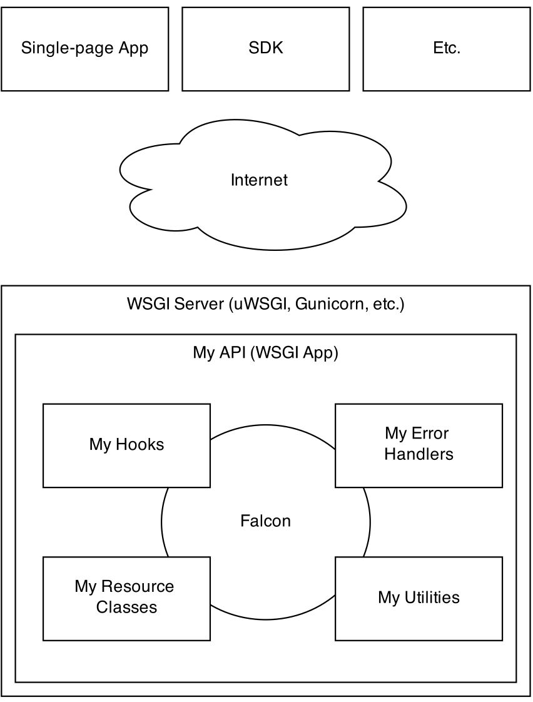

The Big Picture
---------------

Falcon encourages composition over inheritance in order to extend the
functionality of the framework. This helps make applications easier to
maintain and refactor over time.

